# lab2-sql-murder-JuanCamiloMonaLujan
## Datos
- **Detective:** Juan Camilo Moná Luján
- **Correo:** jcamilo.mona@udea.edu.co

## Resumen del Caso
Para resolver el crimen en la ciudad de SQL, se tiene como pista inicial que el asesinato ocurrió el 15 de enero de 2015. Entonces se tiene el testimonio de dos testigos que apuntan a un asesino gracias a la relación que tenia con un gimnasio, donde fue reconocido por el primer testigo y la bolsa del mismo gimnasio que fue vista por el segundo testigo el dia del crimen. Además por la conexión a un evento al que asistió el asesino el mismo dia del crimen, se llego al ejecutor del crimen. Este confienza el crimen y declara que hay una autora intelectual del mismo. El crimen es resuelto.
## Bitacora de investigación
### Query 1
```SQL
SELECT * FROM crime_scene_report WHERE date=20180115 AND city='SQL City' AND type='murder'
```
### Evidencia
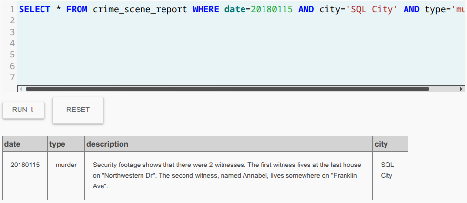

> **Conclusión**
> Analizando la salida de la consulta, se encontró que las imágenes de seguridad muestran dos 
> testigos. Para una se da el nombre y la dirección y para otro solo se da el barrio. Estas 
> constituyen las dos primeras pistas para buscar al asesino.

---

### Query 2
```SQL
SELECT * FROM person WHERE address_street_name = "Franklin Ave" AND name LIKE "Annabel%";
```
### Evidencia
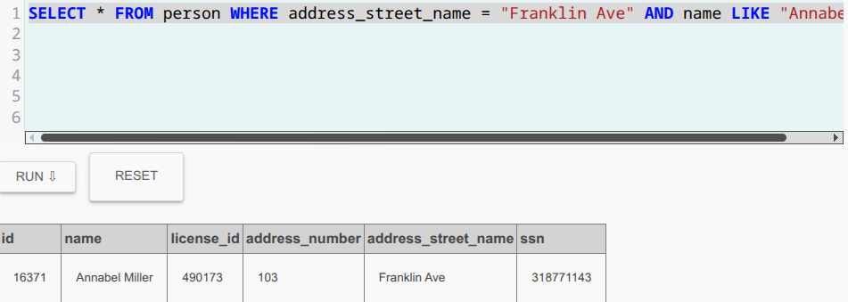

> **Conclusión**
> Según el esquema dado, se hace la busqueda del primer testigo en la tabla persona, la cual se le 
> proporciona el nombre y la calle donde vive. Con el id de persona se tiene una pista para buscar
> en la tabla de entrevistas

---

### Query 3
```SQL
SELECT * FROM interview WHERE person_id = 16371
```

### Evidencia
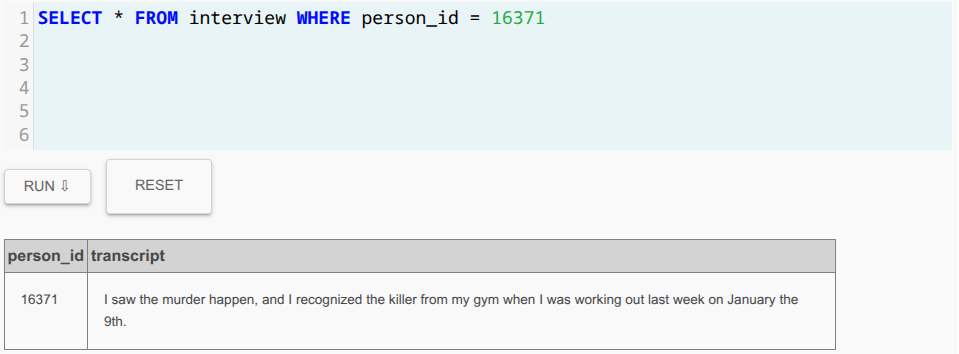

> **Conclusión**
> Se busca en la tabla de entrevistas por id de persona y se encuentra el testimonio que uno de los
> testigos reconoció el asesino, como una persona que fue al gimnasio en el que ella entrena
> la semana pasada. 

---

### Query 4
```SQL
SELECT i.person_id, i.transcript, p.name, p.address_street_name 
FROM interview AS i 
JOIN person AS p ON p.id = i.person_id 
WHERE p.address_street_name = "Northwestern Dr"
```

### Evidencia
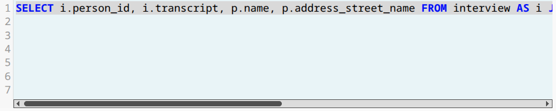
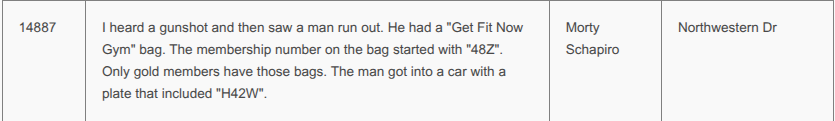

> **Conclusión**
> Haciendo la union de las tablas persona y entrevista, tomando como coincidencia la calle donde
> vive uno de los testigos, se encuentra una declaración de que el testigo se llama Morty Schapiro
> y que este escuchó un disparo y luego vio a un hombre correr con una bolsa del gimnasio 
> "Get Fit Now" lo que lo relaciona con la declaración del primer testigo que dice haberlo reconocido
> en el gimnasio al que entrena. Además se proporciona parte del numero de socio y la matrícula 
> de un coche.

---

### Query 5
```SQL
SELECT *
FROM get_fit_now_member              
WHERE id LIKE "48Z%" AND membership_status = 'gold'        
```

### Evidencia
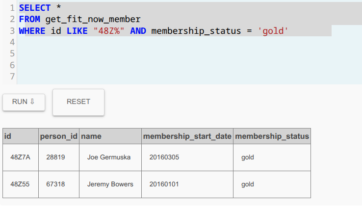

> **Conclusión**
> Se busca por la primera pista del testigo que vio correr al asesino, por el número de socio
> y por el status gold, se encuentran dos sopechosos Joe Germuska y Jeremy Bowers

---
### Query 5
```SQL
SELECT * 
FROM facebook_event_checkin   
WHERE person_id IN (28819, 67318)      
```

### Evidencia
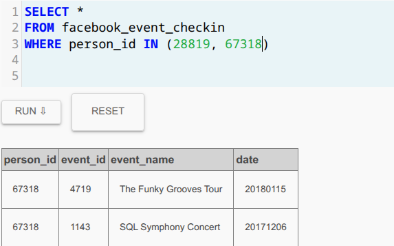

> **Conclusión**
> Los resultados de la consulta muestra que la persona con el id 67318 asiste al evento de
> Funky grooves tour el mismo día del asesinato, lo que lleva a pensar que Jeremy Bowers es
> el principal sospechoso.

---
### Query 5
```SQL
INSERT INTO solution VALUES (1, 'Jeremy Bowers');     
        SELECT value FROM solution;
```

### Evidencia
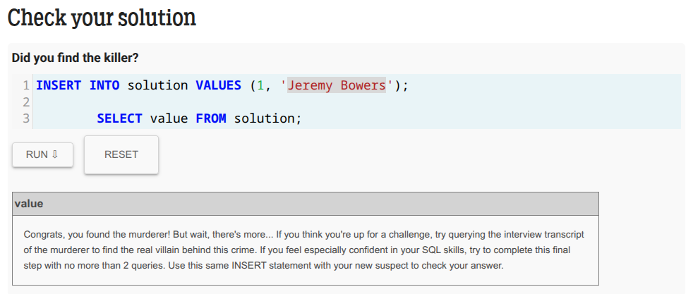

> **Conclusión**
> Se inserta en la solución el nombre de Jeremy Bowers, por  lo que se encontró el asesino
> luego se dice que se busque la entrevista del asesino ya que esto nos llevaria a una segunda
> persona implicada en el crimen.


---
### Query 6
```SQL
SELECT *
FROM interview             
WHERE person_id = 67318
```

### Evidencia
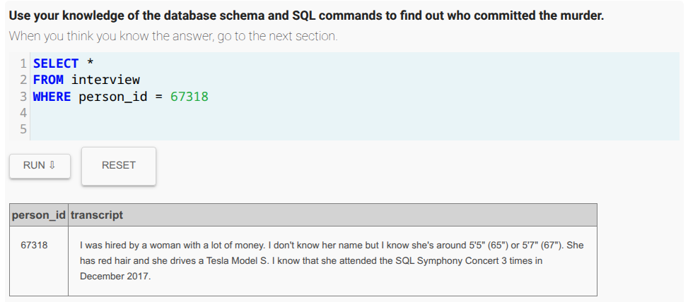

> **Conclusión**
> Al buscar la entrevista con el id de Jeremy Bowers se encuentra que este fue ordenado
> por una mujer con mucho dinero de pelo color rojo, conduce un tesla y que asistió a un evento
> en diciembre de 2017 llamado el concierto de SQL Symphony.


---
### Query 7
```SQL
SELECT fe.event_id, fe.event_name, fe.date, 
        p.id, p.name, 
        dl.age, dl.hair_color, dl.car_model, dl.car_make,
        i.annual_income
FROM facebook_event_checkin AS fe
JOIN person AS p ON p.id = fe.person_id
JOIN drivers_license AS dl ON dl.id = p.license_id
JOIN income AS i ON i.ssn = p.ssn
WHERE fe.event_name LIKE 'SQL%' AND 
fe.date BETWEEN 20171201 AND 20171231 AND 
dl.hair_color = 'red' AND
dl.car_make = 'Tesla' 
```

### Evidencia
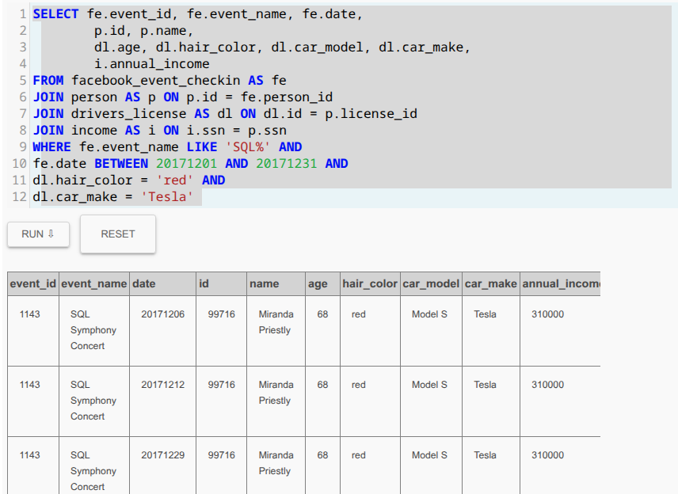

> **Conclusión**
> Se hace una query que une todas las pistas dadas por Jeremy en su declaración, lo que nos lleva
> a una sospechosa llamada Miranda Priestly, que es la presunta autora intelectual del asesinato

---
### Query 8
```SQL
INSERT INTO solution VALUES (1, 'Miranda Priestly');
        SELECT value FROM solution;
```

### Evidencia
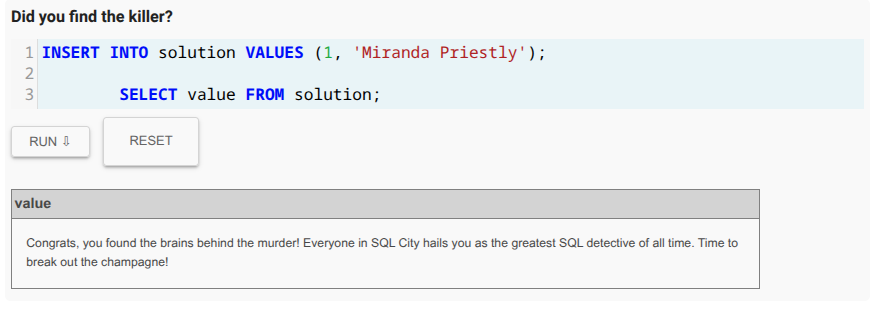

> **Conclusión**
> Se inserta el nombre Miranda Priestly y se confirma que es la autora intelectual del crimen
> y que contrato a Jeremy Bowers para que ejecutara el crimen.
